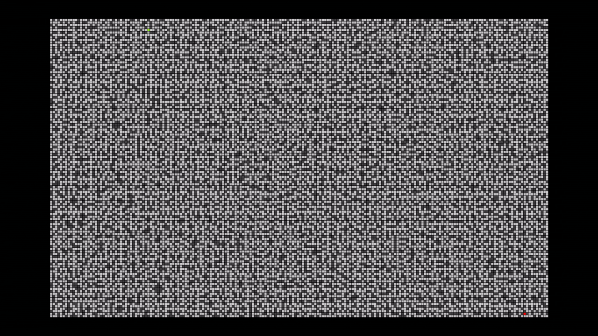
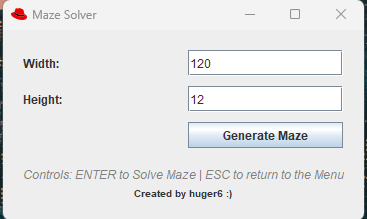
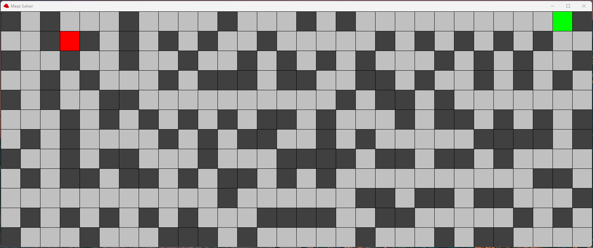
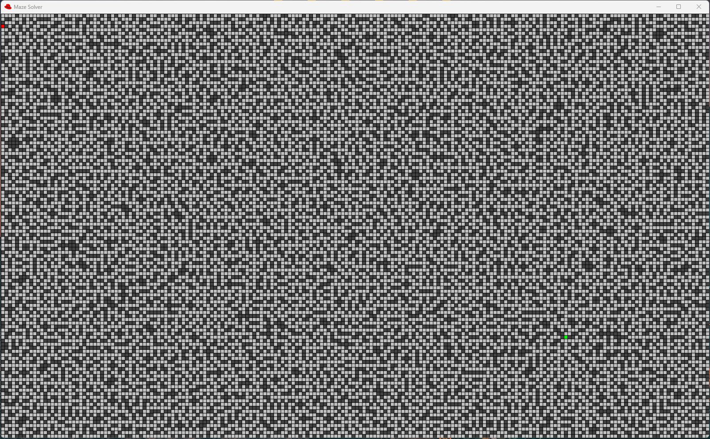

# Maze Solver (Pathfinder)

A Java desktop application that **generates** random mazes and **solves** them using the A* pathfinding algorithm. Mazes are created with Prim's algorithm and visualized through a Swing-based GUI with animated solution playback.



> *Demonstration: a 200×120 maze being generated and solved in real time.*

---

## Table of Contents

- [Features](#features)
- [Screenshots](#screenshots)
- [Algorithms](#algorithms)
  - [Maze Generation — Prim's Algorithm](#maze-generation--prims-algorithm)
  - [Pathfinding — A* Search](#pathfinding--a-search)
- [Project Structure](#project-structure)
- [Prerequisites](#prerequisites)
- [Getting Started](#getting-started)
- [Controls & Workflow](#controls--workflow)
- [Maze File Format](#maze-file-format)
- [Color Legend](#color-legend)
- [License](#license)

---

## Features

- **Random maze generation** of any width × height using Prim's algorithm.
- **Automatic pathfinding** from start to end using the A* search algorithm.
- **Animated solution playback** — watch the shortest path being traced step-by-step.
- **Dynamic cell sizing** — the display automatically scales to fit your screen.
- **Import / Export** — mazes can be saved to and loaded from text files.
- **Simple menu UI** — enter dimensions, click a button, and explore.

---

## Algorithms

### Maze Generation — Prim's Algorithm

The maze is generated using a **randomized version of Prim's algorithm**:

1. Initialize every cell in the grid as a **wall**.
2. Pick a random cell, mark it as a **passage**, and add its wall-neighbors to a *wall list*.
3. While the wall list is not empty:
   - Pick a **random wall** from the list.
   - If the wall has exactly **one** adjacent passage cell, carve it open (mark as passage) and add its wall-neighbors to the list.
   - Remove the wall from the list.
4. The **first** cell carved becomes the **start**; the **last** cell carved becomes the **end**.

This produces a perfect maze (exactly one path between any two cells) with an organic, branching appearance.

### Pathfinding — A* Search

The solver uses the **A\* (A-star) search algorithm** with the **Manhattan distance** heuristic:

- **g(n)** — The actual cost from the start node to node *n* (each step costs 1).
- **h(n)** — The heuristic estimate from *n* to the end, calculated as: $h(n) = |x_n - x_{end}| + |y_n - y_{end}|$
- **f(n) = g(n) + h(n)** — Total estimated cost used by the priority queue to select the next node.

The algorithm maintains an **open list** (priority queue sorted by f-cost) and a **closed set** (visited nodes). It continuously expands the most promising node until the end is reached, then reconstructs the shortest path by tracing parent pointers back to the start.

---

## Project Structure

```
maze-solver/
├── LICENSE
├── README.md
├── mazes/                          # Sample maze files
│   ├── prim_maze.txt               # An exported unsolved maze
│   └── prim_maze_solved.txt        # The same maze with the solution path
├── results/                        # Screenshots and demo video
│   ├── demonstration-200-120.gif   # GIF demo of a 200×120 maze solve
│   ├── demonstration-200-120.mp4   # Video demo of a 200×120 maze solve
│   ├── maze-200x120.png            # Screenshot of large solved maze
│   ├── maze-30x12-default.png      # Screenshot of default-size maze
│   └── menu.png                    # Screenshot of the menu screen
└── src/                            # Source code
    ├── Main.java                   # Entry point — launches the App
    ├── App/
    │   └── App.java                # Application controller (JFrame, navigation)
    ├── Display/
    │   └── MazeDisplay.java        # Swing panel for rendering & animating the maze
    ├── Maze/
    │   ├── Maze.java               # Maze grid, Prim's generation, file I/O
    │   └── Node.java               # Single cell: coordinates, costs, wall/path state
    ├── Menu/
    │   └── Menu.java               # Input form for maze dimensions
    └── Pathfinder/
        └── Pathfinder.java         # A* solver, heuristic, path reconstruction
```

---

## Prerequisites

- **Java JDK 8** or later (JDK 17+ recommended).
- No external libraries — the project uses only the Java standard library (`javax.swing`, `java.awt`, `java.util`, `java.io`, `java.nio`).

---

## Getting Started

### Compile

```bash
javac src/Main.java src/Maze/*.java src/Pathfinder/*.java src/Display/*.java src/App/*.java src/Menu/*.java
```

### Run

```bash
java -cp src Main
```

The menu window will appear. Enter the desired width and height, then click **Generate Maze**.

---

## Controls & Workflow

| Step | Action | Description |
|------|--------|-------------|
| 1 | **Set dimensions** | Type the desired width and height in the menu text fields (defaults: 30 × 12). |
| 2 | **Generate** | Click the **"Generate Maze"** button. A random maze is created with Prim's algorithm and immediately solved (path computed in memory). The maze is displayed without the solution visible. |
| 3 | **Reveal solution** | Press **`Enter`** to start the animated solution. The shortest path is drawn cell-by-cell in yellow at ~50 ms intervals. |
| 4 | **Return to menu** | Press **`Escape`** at any time to go back to the menu and generate a new maze. |

### Workflow Diagram

```
 ┌──────────────┐    Click Generate    ┌──────────────────┐
 │     Menu     │ ──────────────────▸  │   Maze Display   │
 │  (set W×H)   │                      │  (unsolved view) │
 └──────────────┘ ◂────── ESC ───────  └────────┬─────────┘
                                                │ ENTER
                                                ▾
                                      ┌────────────────────┐
                                      │  Animated Solve    │
                                      │ (yellow path drawn)│
                                      └────────────────────┘
```

---

## Maze File Format

Mazes can be saved to and loaded from plain-text files. The format is:

```
width=<W>
height=<H>
<grid rows...>
```

Character legend in text files:

| Character | Meaning |
|-----------|---------|
| `#` | Wall |
| ` ` (space) | Open passage |
| `S` | Start cell |
| `E` | End cell |
| `.` | Solution path |

Example files are provided in the `mazes/` directory.

---

## Color Legend

| Color | Meaning |
|-------|---------|
| **Dark Gray** | Wall |
| **Light Gray** | Open passage |
| **Green** | Start node |
| **Red** | End node |
| **Yellow** | Solution path (animated) |

---

## Screenshots

### Menu



*The main menu where the user inputs the desired maze dimensions (width and height) and clicks "Generate Maze" to proceed. Controls information is displayed at the bottom.*

### Generated Maze (Default 30×12)



*A freshly generated 30×12 maze using the default dimensions. The **green** cell marks the start point and the **red** cell marks the end point. The solution has not been revealed yet.*

### Large Maze (200×120) — Solved



*A large 200×120 maze after the A* solution has been animated. The **yellow** trail shows the shortest path discovered between the start and end nodes.*

---

## License

This project is distributed under the terms specified in the [LICENSE](LICENSE) file.